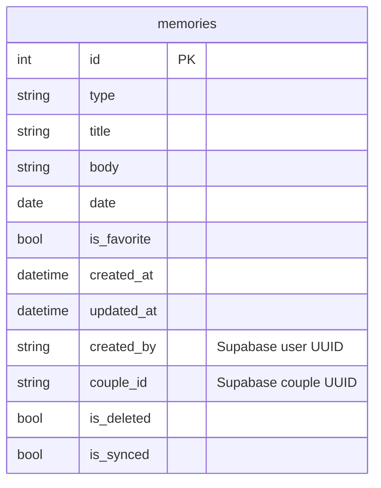

# Serenity — Architecture Guide

> **Owner:** Engineering team
> **Purpose:** Complete technical reference for the Serenity application. Every subsystem, data flow, and structural decision is documented here.
> **Related:** [Decisions](DECISIONS.md) | [Build Guide](BUILD.md) | [Product Guide](PRODUCT.md)

---

## Table of Contents

1. [Tech Stack](#1-tech-stack)
2. [Architecture Overview](#2-architecture-overview)
3. [Local-First Strategy](#3-local-first-strategy)
4. [Database (Drift)](#4-database-drift)
5. [State Management (Riverpod)](#5-state-management-riverpod)
6. [Sync Engine](#6-sync-engine)
7. [Auth Flow](#7-auth-flow)
8. [Couple Linking](#8-couple-linking)
9. [Design System](#9-design-system)
10. [Theme System](#10-theme-system)
11. [Navigation](#11-navigation)
12. [Folder Structure](#12-folder-structure)
13. [Repository Layer](#13-repository-layer)
14. [Supabase Integration](#14-supabase-integration)

---

## 1. Tech Stack

| Layer | Technology | Version |
|-------|-----------|---------|
| Framework | Flutter | 3.x |
| Language | Dart | ^3.12.1 |
| State management | Riverpod (flutter_riverpod) | ^2.6.0 |
| Local database | Drift + SQLite | ^2.24.0 |
| Navigation | GoRouter (inside app) + Navigator (auth gate) | ^14.0.0 |
| Backend | Supabase (supabase_flutter) | ^2.15.0 |
| Icons | Lucide Icons | ^3.1.14 |
| Fonts | Inter, Plus Jakarta Sans, Cormorant Garamond | — |
| Code generation | build_runner + drift_dev | ^2.4.0 / ^2.24.0 |

See [BUILD.md](BUILD.md) for exact toolchain versions.

---

## 2. Architecture Overview

Serenity follows a layered architecture with clear boundaries:

```
┌──────────────────────────────────────────────────┐
│                    UI Layer                       │
│  Screens (ConsumerStatefulWidget)                 │
│  Widgets / Components                             │
│  Bottom Nav (Story, Reflect, Me)                  │
└────────────────┬─────────────────────────────────┘
                 │ reads via ref.watch()
┌────────────────▼─────────────────────────────────┐
│              Provider Layer (Riverpod)            │
│  StateNotifierProvider / FutureProvider / Stream   │
│  Provider / StateProvider                         │
│  ┌────────────────────────────────────────────┐   │
│  │        Sync Providers                      │   │
│  │  syncStateProvider (StateNotifier)         │   │
│  │  coupleStatusProvider (FutureProvider)     │   │
│  └────────────────────────────────────────────┘   │
└────────────────┬─────────────────────────────────┘
                 │ delegates to
┌────────────────▼─────────────────────────────────┐
│             Repository / Service Layer            │
│  SyncService  │  CoupleService  │  AuthProvider   │
│  SyncNotifier │  DAOs (9)       │                 │
└────────────────┬─────────────────────────────────┘
                 │ reads/writes
┌────────────────▼─────────────────────────────────┐
│               Data Layer                          │
│  Drift Database (9 tables)                        │
│  Supabase Client (8 remote tables)                │
│  SyncMetadata (local key-value)                   │
└───────────────────────────────────────────────────┘
```

### Architecture Philosophy

Serenity is a **local-first** architecture — not an offline-only architecture. See [DECISIONS.md](DECISIONS.md) entry #9 for why this evolved.

| Layer | Role |
|-------|------|
| Local storage (Drift) | Provides speed and immediate access |
| Sync engine | Provides continuity between devices |
| Supabase | Enables shared experiences |
| Offline capability | Provides resilience when disconnected |

No single layer is the source of truth. The local database is the primary interface for reads and writes. Supabase is the sync substrate. The sync engine keeps them aligned.

### Data Flow

```
                    ┌──────────────┐
                    │  User writes │
                    │  a Memory    │
                    └──────┬───────┘
                           │
                    ┌──────▼───────┐
                    │  MemoriesDao │── set isSynced = false
                    └──────┬───────┘
                           │
              ┌────────────▼────────────┐
              │      Local Drift        │
              │      Database (SQLite)  │
              │  ┌──────────────────┐   │
              │  │ Shared: memories │   │
              │  │ milestones, etc. │   │
              │  │ Personal:        │   │
              │  │ reflections,     │   │
              │  │ settings, prefs  │   │
              │  └──────────────────┘   │
              └────────────┬────────────┘
                           │
              ┌────────────▼────────────┐
              │      Sync Engine        │
              │  Push: isSynced=false   │
              │  Pull: last_pull_at     │
              │  Conflict: LWW          │
              └────────────┬────────────┘
                           │
              ┌────────────▼────────────┐
              │       Supabase          │
              │  ┌──────────────────┐   │
              │  │ Shared tables    │   │
              │  │ (8, RLS enforced)│   │
              │  └──────────────────┘   │
              └────────────┬────────────┘
                           │
              ┌────────────▼────────────┐
              │    Partner's Device     │
              │  (pull → local DB)      │
              └─────────────────────────┘
```

### Write Path (Local-first)

1. User creates memory on screen
2. Screen calls DAO method (createMemory)
3. DAO inserts into local Drift database with `isSynced = false`
4. UI updates immediately from local DB (via Riverpod watch)
5. Sync engine picks up the unsynced row on next push cycle
6. Row is upserted to Supabase
7. Partner receives it on their next pull cycle

### Read Path

All reads go through local Drift database. No reads hit Supabase directly. This ensures offline access and consistent performance.

---

## 3. Local-First Strategy

Serenity uses a local-first architecture. The local database is always the primary interface. Cloud sync exists only to bridge two devices.

### Principles

- **Local writes are immediate.** No "saving..." state. The UI always reads from the local database.
- **Sync is background-only.** Never blocks the UI. Never requires user attention.
- **Shared data syncs, personal data stays local.** Memories, milestones, and daily questions are shared. Reflections, settings, and preferences remain on-device.
- **Conflicts are rare and acceptable.** For a journal app where both partners rarely edit the same entry simultaneously, last-write-wins is sufficient.
- **No sync UI.** Users see a subtle status indicator, never a sync progress bar.

### Data Philosophy

| Category | Content | Behavior |
|----------|---------|----------|
| **Shared** | Memories, milestones, appreciations, daily questions, tags, timeline | Syncs automatically. Accessible to both partners. Stored locally and in Supabase. |
| **Personal** | Reflections, device settings, theme, security preferences, app lock | Local only. Never synced. Not visible to partner. |

This boundary is enforced at the DAO level — only tables with `isSynced` columns participate in sync. Tables like `settings` and `memory_media` are intentionally excluded from the sync engine.

### Connectivity Management

The app uses `connectivity_plus` to monitor network state:

1. On app launch: attempt sync if online
2. On connectivity change (offline → online): trigger sync automatically
3. On connectivity change (online → offline): set state to `SyncStatus.offline`
4. On write: set `isSynced = false` (sync engine will pick up later)

### Sync Trigger Model

```dart
SyncState = idle | syncing | synced | error | offline
```

- `idle` — ready, no sync in progress
- `syncing` — push or pull in progress
- `synced` — last sync completed at timestamp
- `error` — last sync failed with message
- `offline` — no connectivity detected

---

## 4. Database (Drift)

### Local Schema Version: 3

The app uses SQLite via Drift for all local storage.

### Tables

| Table | Schema | Syncable | Has isSynced |
|-------|--------|----------|-------------|
| `memories` | v3 | Yes | Yes |
| `memory_media` | v1 | No (local only) | No |
| `milestones` | v3 | Yes | Yes |
| `settings` | v1 | No (local only) | No |
| `reflections` | v3 | Yes | Yes |
| `question_answers` | v3 | Yes | Yes |
| `tags` | v3 | Yes | Yes |
| `tag_assignments` | v3 | Yes | Yes |
| `sync_metadata` | v3 | No (sync state) | No |

### Migration History

- **v1 (initial):** memories, memory_media, milestones, settings tables
- **v2:** Added isSynced columns, migrated old MemoryTags to Tags + TagAssignments, seeded 10 preset tags, added updatedAt + type to milestones
- **v3:** Added sync columns (created_by, couple_id, is_deleted) to all syncable tables, created sync_metadata table

### Sync Columns



### Drift DAOs

Each DAO encapsulates database operations for one table. DAOs with sync support always set `isSynced = false` on create and update:

| DAO | Operations |
|-----|-----------|
| `MemoriesDao` | CRUD + favorite toggle |
| `MilestonesDao` | CRUD |
| `TimelineDao` | Reads all syncable content with ordering |
| `TagsDao` | CRUD + tag assignment management |
| `ReflectionsDao` | CRUD + date-based queries |
| `QuestionAnswersDao` | CRUD + date-based queries |
| `CalendarDao` | Aggregated date-based queries |
| `SettingsDao` | Simple key-value preferences |
| `SyncMetadataDao` | Key-value for sync state |

---

## 5. State Management (Riverpod)

Serenity uses Riverpod for all state management. No StatefulWidget state is used for data (only UI transient state like text controllers).

### Provider Categories

```dart
// Global state (app-wide)
final onboardedProvider        // StateProvider<bool>
final themeModeProvider        // StateProvider<AppTheme>
final brightnessProvider       // StateProvider<Brightness>

// Auth
final supabaseInitProvider     // FutureProvider<void>
final authStatusProvider       // StreamProvider<AuthStatus>
final currentUserProvider      // Provider<User?>
final authProvider             // Provider<AuthProvider>

// Couple
final coupleServiceProvider    // Provider<CoupleService>
final coupleStatusProvider     // FutureProvider<Map?>

// Database
final databaseProvider         // Provider<AppDatabase>
final memoriesDaoProvider      // Provider<MemoriesDao>
final ... etc (9 DAO providers)

// Sync
final syncServiceProvider      // Provider<SyncService>
final syncStateProvider        // StateNotifierProvider<SyncNotifier, SyncState>
final syncMetadataDaoProvider  // Provider<SyncMetadataDao>

// Feature-specific
final timelineProvider         // Provider for timeline entries
final currentQuestionProvider  // Provider for daily question
final questionRefreshCount     // StateProvider<int> for question cycling
```

### Auth Gate Architecture

```
main.dart
  └── ProviderScope
      └── AuthGate (ConsumerWidget)
          ├── loading  → _SplashContent
          ├── error    → SignInScreen
          └── data (by auth status)
              ├── unauthenticated → SignInScreen
              ├── authenticated, no couple → CoupleLinkingScreen
              └── authenticated, coupled → SerenityApp
```

AuthGate uses two separate MaterialApp instances:
- **Auth shell** (unauthenticated): plain MaterialApp with Navigator — lighter weight than GoRouter
- **App shell** (authenticated + linked): `SerenityApp` with GoRouter + bottom nav

---

## 6. Sync Engine

### Architecture

```
┌─────────────────────────────────────────────┐
│              SyncNotifier                     │
│  (StateNotifier<SyncState>)                  │
│  - Listens to connectivity changes           │
│  - Calls triggerSync() on online transition  │
└──────────────────┬──────────────────────────┘
                   │
┌──────────────────▼──────────────────────────┐
│              SyncService                      │
│  push() → local Drift → Supabase (upsert)    │
│  pull() → Supabase → local Drift (upsert)    │
└─────────────────────────────────────────────┘
```

### Push Flow

1. Read all rows with `isSynced = false` from local DB
2. Upsert to Supabase with couple_id
3. On success: mark `isSynced = true` locally
4. One table at a time: memories, milestones, reflections, question_answers, tags, tag_assignments

### Pull Flow

1. Read `last_pull_at` from SyncMetadata
2. Query Supabase for rows newer than `last_pull_at` for this couple
3. For each returned row:
   - If it has `updated_at`: compare timestamps (remote wins if newer)
   - If no `updated_at` (reflections, tags, etc.): insert if not present locally
4. Update `last_pull_at` to current time

### Conflict Resolution

```
Push: Local always wins (we're sending our changes)
Pull:
  - Remote updated_at > local updated_at → accept remote
  - Local updated_at >= remote updated_at → keep local
  - Remote is_deleted = true → soft-delete locally
  - Local is_deleted = true AND synced → remote soft-delete
```

**Trade-off:** If both partners edit the same entry offline, the first push wins. The second pull sees the remote is newer and accepts it. The later editor's changes are silently overwritten. This is acceptable for a journal app where simultaneous editing is rare. See [DECISIONS.md](DECISIONS.md) entry #3.

---

## 7. Auth Flow

```
                    ┌──────────────┐
                    │  App Launch  │
                    └──────┬───────┘
                           │
                    ┌──────▼───────┐
                    │  Has Saved   │
                    │  Session?    │
                    └──┬───────┬───┘
                  No   │       │  Yes
              ┌────────▼┐     │
              │SignInScreen│   │
              └──┬────┬──┘    │
      "Sign Up"  │    │ "Sign │
          ┌──────▼┐   │ In"  │
          │SignUp │   │      │
          │Screen │   │      │
          └──┬────┘   │      │
             │        │      │
              └──┬────┘      │
                 │           │
          ┌──────▼───────────▼──┐
          │  CoupleLinkingScreen│
          │  (create or join)   │
          └──┬──────────────┬──┘
    Create  │              │  Join
      ┌─────▼────┐   ┌─────▼────┐
      │CreateCode│   │EnterCode │
      │Screen    │   │Screen    │
      └─────┬────┘   └─────┬────┘
            └──────┬───────┘
                   │
          ┌────────▼────────┐
          │  SerenityApp    │
          │  (Timeline)     │
          └─────────────────┘
```

### Auth Provider

```dart
enum AuthStatus { unknown, authenticated, unauthenticated }

final authStatusProvider = StreamProvider<AuthStatus>((ref) {
  return Supabase.instance.client.auth.onAuthStateChange.map((response) {
    if (response.session?.user != null) return AuthStatus.authenticated;
    return AuthStatus.unauthenticated;
  });
});
```

Supabase SDK handles session persistence automatically via shared_preferences. On app launch, the SDK checks for a saved session and restores it.

---

## 8. Couple Linking

### Invite Code System

- **Format:** 6-character alphanumeric (A-Z, 0-9), uppercase
- **Expiry:** 24 hours from creation
- **Generation:** Random with collision checking (36^6 ≈ 2 billion combinations)
- **Creation:** User A creates a `couples` row with `partner_a_id` set and `partner_b_id` null
- **Joining:** User B enters the code, row is updated with `partner_b_id` and `linked_at`
- **Self-link prevention:** Prevents entering your own code

### Edge Cases

| Case | Behavior |
|------|----------|
| Wrong code | "Invalid invite code" error |
| Expired code | "Code has expired" error |
| Code already used | "Already been used" error |
| Partner deletes account | Couple row updated, remaining user sees "Partner disconnected" |
| User unlinks | Partner A deletes couple row; Partner B clears their link |
| Both offline when linking | Linking requires online (Supabase writes) |

### RLS Strategy

See [DECISIONS.md](DECISIONS.md) entry #4 for the invite code RLS design. Policies allow anyone to look up a valid (non-expired, unused) code by code value only. All other couple data is restricted to the two partners.

---

## 9. Design System

### Visual Language

- **Rounded corners:** 12px cards, 8px inputs, 16px FAB, 999px chips
- **Typography hierarchy:** Plus Jakarta Sans for headings, Inter for body, Cormorant Garamond for editorial/reflective text
- **Spacing:** Generous whitespace, low information density
- **Elevation:** Flat design — no shadows. Cards distinguished by borders and color.
- **Motion:** Subtle fade + slide transitions for modals. Bottom nav uses Material built-in transitions.

### Component Library

```
components/
  serenity_bottom_nav.dart    # 3-tab navigation (Story, Reflect, Me)
  serenity_card.dart          # Base card component
  serenity_header.dart        # Screen headers
  timeline_card.dart          # Memory/milestone timeline card
  calendar_widget.dart        # Date navigation/calendar
  category_badge.dart         # Category indicators
  milestone_chip.dart         # Milestone badges
  appreciation_block.dart     # Appreciation entry display
  section_divider.dart        # Themed section separators
  sync_status_indicator.dart  # Sync state icon (cloud/offline)
```

---

## 10. Theme System

### 5 Themes

| Theme | Primary Color | Vibe |
|-------|--------------|------|
| **Warm Rose** (default) | `#D4737A` | Warm, intimate, default |
| Sage Garden | `#7A9E7A` | Calm, natural |
| Ocean Calm | `#6A9FB5` | Cool, serene |
| Terracotta | `#C27A5A` | Earthy, grounded |
| Lavender Night | `#8A7AB5` | Soft, dreamy |

### Dark + Light Mode

Every theme has both dark and light variants. Dark mode is the default experience. Brightness can be toggled in settings.

### Typography System

```dart
displayLarge:  40/48  Plus Jakarta Sans 700
headlineLarge: 32/40  Plus Jakarta Sans 600
headlineMedium:28/36  Plus Jakarta Sans 600
headlineSmall: 22/30  Plus Jakarta Sans 500
titleLarge:    18/26  Plus Jakarta Sans 500
bodyLarge:     16/24  Inter 400
bodyMedium:    14/22  Inter 400
bodySmall:     12/18  Inter 400
labelLarge:    14/20  Plus Jakarta Sans 500
labelMedium:   12/17  Plus Jakarta Sans 500
labelSmall:    10/14  Plus Jakarta Sans 500

// Editorial (reflective/journaling text)
editorialQuote: 22/30  Cormorant Garamond 300 italic
editorialBody:  16/24  Cormorant Garamond 400 italic
```

### Color Palette Structure

Each theme has these color slots (5 themes x 2 brightness = 10 palettes):

```
bg              // Scaffold background
card            // Card/surface color
border          // Outline, dividers
text            // Primary text
textSecondary   // Secondary/variant text
primary         // Accent color, buttons, active states
primaryVariant  // Lighter primary for secondary elements
accent          // Deeper accent variant
```

---

## 11. Navigation

### Auth Gate (Pre-auth)

Uses a plain `MaterialApp` with `Navigator` (no GoRouter). This is deliberate — auth screens don't need URL-based routing or deep linking. See [DECISIONS.md](DECISIONS.md) entry #1.

### App Shell (Post-auth)

Uses `MaterialApp.router` with GoRouter:

```
Routes:
  /                   → TimelineScreen (tab: Story)
  /reflect            → ReflectScreen (tab: Reflect)
  /me                 → MeScreen (tab: Me)
  /onboarding         → OnboardingScreen (pre-auth setup)
  /create-memory      → CreateMemoryScreen (modal)
  /create-milestone   → CreateMilestoneScreen (modal, optional ?id for edit)
  /memory/:id         → MemoryDetailScreen
  /calendar           → CalendarScreen
  /question-history   → QuestionHistoryScreen
```

The bottom nav uses `StatefulShellRoute.indexedStack` to preserve tab state across navigation.

### Transition Animations

- Modal routes (create memory, create milestone): slide up + fade in (300ms ease-out cubic)
- Tab switches: instant (stacked, no transition animation)
- Detail screens: default GoRouter transition (platform-native)

---

## 12. Folder Structure

```
lib/
  main.dart                          # Entry point, ProviderScope, AuthGate
  app.dart                           # SerenityApp (post-auth, GoRouter)

  core/
    auth/
      auth_gate.dart                 # Auth state watcher + screen router
      auth_provider.dart             # AuthProvider + authStatusProvider
    components/
      serenity_bottom_nav.dart
      serenity_card.dart
      serenity_header.dart
      timeline_card.dart
      ... (10 components)
    database/
      app_database.dart              # Drift DB, migrations v1→v3
      app_database.g.dart            # Generated code
      database_provider.dart         # All DAO providers
      daos/                          # 9 DAO classes
      tables/                        # 9 Drift table definitions
    providers/
      app_providers.dart             # Global state providers
    router/
      app_router.dart                # GoRouter configuration
    supabase/
      supabase_config.dart           # URL + publishableKey
    sync/
      sync_service.dart              # Push/pull engine
      sync_provider.dart             # SyncNotifier + connectivity
      sync_state.dart                # SyncState/SyncStatus types
    theme/
      app_theme.dart                 # ThemeData builder (all 5 themes)
      palette.dart                   # Color values (10 palettes)
      typography.dart                # Text theme + editorial styles
    widgets/                         # (reserved for shared widgets)
    utils/                           # (reserved for utilities)

  features/
    auth/
      screens/
        sign_in_screen.dart
        sign_up_screen.dart
        couple_linking_screen.dart   # Create or Join choice
        create_couple_screen.dart    # Display generated code
        join_couple_screen.dart      # Enter code (6-char input)
    couple/
      providers/
        couple_provider.dart         # CoupleService + coupleStatusProvider
      screens/
        couple_settings_screen.dart  # Unlink, regenerate code, partner info
    me/
      export/                        # Data export
      providers/                     # Me-specific providers
      screens/
        me_screen.dart
        onboarding_screen.dart
      settings/                      # App settings
      themes/                        # Theme picker
      widgets/                       # Me-specific widgets
    questions/                       # (reserved, currently empty)
    reflect/
      providers/                     # Question/reflection providers
      repositories/                  # Data access
      screens/                       # Reflect screen
      widgets/                       # Reflection components
    story/
      create/                        # Memory + milestone creation
      models/                        # Timeline entry models
      providers/                     # Timeline provider
      repositories/                  # (reserved)
      screens/                       # Story-specific screens
      timeline/                      # Timeline + calendar
        timeline_screen.dart
        calendar_screen.dart
        calendar_provider.dart
        screens/                     # Sub-screens
        widgets/                     # Timeline-specific widgets
```

---

## 13. Repository Layer

Serenity uses a **DAO-based pattern** rather than a formal repository layer. Each DAO wraps a Drift table and exposes methods like `getAll()`, `getById()`, `create()`, `update()`, `delete()`.

This is simpler than a full repository/UoW pattern and appropriate for an app where:
- All data access goes through one local database
- Supabase is only used by the sync engine, never by screens
- There's no API gateway or backend service to abstract

If Serenity grows additional data sources, DAOs would be refactored behind repository interfaces. See [DECISIONS.md](DECISIONS.md) entry #2.

---

## 14. Supabase Integration

### Usage Scope

Supabase is used strictly for:
1. Email + password authentication
2. Cloud storage for sync (8 tables)
3. Row-Level Security for data isolation

Supabase is NOT used for:
- Real-time WebSockets (future possibility, not implemented)
- Edge Functions
- Storage (media sync deferred)
- Realtime subscriptions

### Remote Schema (8 tables)

| Table | Purpose | RLS |
|-------|---------|-----|
| `profiles` | User profile data, extends auth.users | User only |
| `couples` | Couple linking + invite codes | Partners + invite lookup |
| `memories` | Shared memories | Couple members |
| `milestones` | Shared milestones | Couple members |
| `reflections` | Shared reflections | Couple members |
| `question_answers` | Shared Q&A | Couple members |
| `tags` | Shared tags | Couple members |
| `tag_assignments` | Tag-memory links | Couple members |

### Row-Level Security

23 RLS policies enforce data isolation:
- Profile policies: authenticated users read/update their own profile
- Couple policies: partners read/update their couple, anyone reads valid invite codes
- Content policies (all 6 content tables): couple members CRUD, created_by enforced on insert
- Delete policies: cascade behavior through foreign keys

### Configuration

```dart
class SupabaseConfig {
  static const String url = 'https://keynxnucfkxovlvysgym.supabase.co';
  static const String publishableKey =
      'sb_publishable_N6ZU9dxuV1cjklg_vbzU_A_3Kcbd22Z';
}
```

See [DECISIONS.md](DECISIONS.md) entry #5 for why we switched from `anonKey` to `publishableKey`.
